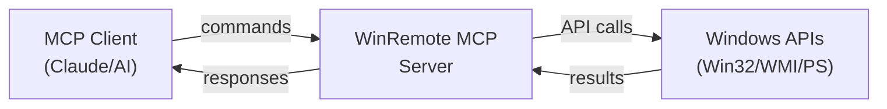

# WinRemote MCP — Run MCP Servers Remotely on Windows

[](https://pypi.org/project/winremote-mcp/)
[](https://pypi.org/project/winremote-mcp/)
[](https://opensource.org/licenses/MIT)
[](https://github.com/dddabtc/winremote-mcp/actions/workflows/ci.yml)
[](https://pepy.tech/projects/winremote-mcp)
[](https://glama.ai/mcp/servers/dddabtc/win-remote-mcp)

**The ultimate Windows MCP server for remote desktop control and automation.** Control any Windows machine through the Model Context Protocol — perfect for AI agents, Claude Desktop, and OpenClaw integration. Transform your Windows desktop into a powerful, remotely-accessible automation endpoint.

Run **on the Windows machine** you want to control. Built with [FastMCP](https://github.com/jlowin/fastmcp) and the [Model Context Protocol](https://modelcontextprotocol.io/).

## Quickstart (30 seconds)

```bash
# Install from PyPI
pip install winremote-mcp

# Start the Windows MCP server
winremote-mcp
```

That's it! Your Windows MCP server is now running on `http://127.0.0.1:8090` and ready to accept commands from MCP clients like Claude Desktop or OpenClaw.

## What's New in v0.4.8

- ✅ Added compatibility with **fastmcp 3.x** internal tool registry changes
- ✅ Kept compatibility with **fastmcp 2.x**
- ✅ Fixed tool wrapping/filtering paths that could raise:
  `AttributeError: 'FastMCP' object has no attribute '_tool_manager'`

## What Problem It Solves

- **Remote Windows Control**: Control Windows desktops from anywhere through standardized MCP protocol
- **AI Agent Integration**: Enable Claude, GPT, and other AI agents to interact with Windows GUI applications  
- **Cross-Platform Automation**: Bridge the gap between Linux/macOS development environments and Windows targets
- **Headless Windows Management**: Manage Windows servers and workstations without RDP or VNC overhead

## Features

- **Desktop Control** — Screenshot capture (JPEG compressed, multi-monitor), click, type, scroll, keyboard shortcuts
- **Window Management** — Focus windows, minimize-all, launch/resize applications, multi-monitor support
- **Remote Shell Access** — PowerShell command execution with working directory support
- **File Operations** — Read, write, list, search files; binary transfer via base64 encoding
- **System Administration** — Windows Registry access, service management, scheduled tasks, process control
- **Network Tools** — Ping hosts, check TCP ports, monitor network connections
- **Advanced Features** — OCR text extraction, screen recording (GIF), annotated screenshots with UI element labels
- **Security & Auth** — Optional API key authentication, localhost-only binding by default

## 🤖 OpenClaw Integration

winremote-mcp works great with [OpenClaw](https://github.com/openclaw/openclaw) — providing full Windows desktop control as an MCP endpoint for AI agents.

### Setup with OpenClaw

1. **Start winremote-mcp on your Windows machine:**
   ```bash
   pip install winremote-mcp
   winremote-mcp --port 8090
   ```

2. **Configure OpenClaw to use it** — add to your `openclaw.json`:
   ```json
   {
     "plugins": {
       "entries": {
         "winremote": {
           "type": "mcp",
           "url": "http://<WINDOWS_IP>:8090/mcp"
         }
       }
     }
   }
   ```

3. **That's it.** Your AI agent can now:
   - Execute PowerShell/CMD commands on Windows
   - Take screenshots of the desktop
   - Transfer files between Linux and Windows
   - Control GUI applications
   - Access Windows-specific tools and APIs

### No-Auth Mode (for trusted networks)

For home lab / LAN setups where authentication isn't needed:
```bash
winremote-mcp --port 8090 --no-auth
```

> **Note:** winremote-mcp is a standard MCP server — it works with any MCP-compatible client, not just OpenClaw.

## Installation

### From PyPI (Recommended)
```bash
pip install winremote-mcp
```

### From Source
```bash
git clone https://github.com/dddabtc/winremote-mcp.git
cd winremote-mcp
pip install .
```

### With Optional Dependencies
```bash
# Install with OCR support (includes pytesseract)
pip install winremote-mcp[ocr]

# Install development dependencies
pip install winremote-mcp[test]
```

### OCR Setup (Optional)
For text extraction from screenshots:
```bash
# 1. Install Tesseract OCR engine
winget install UB-Mannheim.TesseractOCR

# 2. Install with OCR dependencies
pip install winremote-mcp[ocr]
```

## Usage

### Basic Usage

### Tier and tool controls
```bash
# Default: tier1 + tier2 enabled, tier3 disabled
winremote-mcp

# Enable destructive tier3 tools
winremote-mcp --enable-tier3

# Disable interactive tier2 (tier1 only)
winremote-mcp --disable-tier2

# Both together: tier1 + tier3 (tier2 disabled)
winremote-mcp --enable-tier3 --disable-tier2

# Backward-compatible: enable everything
winremote-mcp --enable-all

# Explicit tool list (highest precedence over tier flags)
winremote-mcp --tools Snapshot,Click,Type

# Remove specific tools from resolved set
winremote-mcp --enable-tier3 --exclude-tools Shell,FileWrite
```

### Config file (`winremote.toml`)
Search order:
1. `--config /path/to/winremote.toml`
2. `./winremote.toml`
3. `~/.config/winremote/winremote.toml`

```toml
[server]
host = "127.0.0.1"
port = 8090
auth_key = ""

[security]
ip_allowlist = ["127.0.0.1", "192.168.1.0/24"]
enable_tier3 = false
disable_tier2 = false

[tools]
enable = ["Snapshot", "Click", "Type"]
exclude = []
```

**Precedence:** CLI flags override config file values; config file values override defaults.

### IP allowlist
```bash
# CLI
winremote-mcp --ip-allowlist 127.0.0.1,192.168.1.0/24

# Or via config [security].ip_allowlist
```

Supports both single IPs and CIDR ranges (IPv4/IPv6). Non-allowlisted clients receive HTTP 403 with a clear error.

### Health check
```bash
# Start MCP server (localhost only, no auth)
winremote-mcp

# Start with remote access and authentication
winremote-mcp --host 0.0.0.0 --port 8090 --auth-key "your-secret-key"

# Enable all tools including high-risk Tier 3 (Shell, FileWrite, etc.)
winremote-mcp --enable-all

# Start with hot reload for development
winremote-mcp --reload
```

### MCP Client Configuration

**For Claude Desktop (`claude_desktop_config.json`):**
```json
{
  "mcpServers": {
    "winremote": {
      "command": "winremote-mcp",
      "args": ["--transport", "stdio"]
    }
  }
}
```

**For OpenClaw or other HTTP MCP clients:**
```json
{
  "mcpServers": {
    "winremote": {
      "type": "streamable-http", 
      "url": "http://192.168.1.100:8090/mcp",
      "headers": {
        "Authorization": "Bearer your-secret-key"
      }
    }
  }
}
```

### Auto-Start on Boot
```bash
# Create Windows scheduled task
winremote-mcp install

# Remove scheduled task  
winremote-mcp uninstall
```

## Security

Tools are organized into three risk tiers. By default, only Tier 1-2 tools are enabled.

| Tier | Risk | Default | Examples |
|------|------|---------|----------|
| **Tier 1** | Read-only | ✅ Enabled | Snapshot, GetSystemInfo, ListProcesses |
| **Tier 2** | Interactive | ✅ Enabled | Click, Type, Shortcut, App |
| **Tier 3** | Destructive | ❌ Disabled | Shell, FileWrite, KillProcess, RegWrite |

```bash
# Enable all tiers (use with caution)
winremote-mcp --enable-all

# Always use auth for remote access
winremote-mcp --host 0.0.0.0 --auth-key "your-secret-key"
```

See [SECURITY.md](SECURITY.md) for the full security guide.

## Tools

| Tool | Description |
|------|-------------|
| **Desktop** | |
| Snapshot | Screenshot (JPEG, configurable quality/max_width) + window list + UI elements |
| AnnotatedSnapshot | Screenshot with numbered labels on interactive elements |
| OCR | Extract text from screen via OCR (pytesseract or Windows built-in) |
| ScreenRecord | Record screen activity as animated GIF |
| **Input** | |
| Click | Mouse click (left/right/middle, single/double/hover) |
| Type | Type text at coordinates |
| Scroll | Vertical/horizontal scroll |
| Move | Move mouse / drag |
| Shortcut | Keyboard shortcuts |
| Wait | Pause execution |
| **Window Management** | |
| FocusWindow | Bring window to front (fuzzy title match) |
| MinimizeAll | Show desktop (Win+D) |
| App | Launch/switch/resize applications |
| **System** | |
| Shell | Execute PowerShell commands (with optional cwd) |
| GetClipboard | Read clipboard |
| SetClipboard | Write clipboard |
| ListProcesses | Process list with CPU/memory |
| KillProcess | Kill process by PID or name |
| GetSystemInfo | System information |
| Notification | Windows toast notification |
| LockScreen | Lock workstation |
| ReconnectSession | Reconnect disconnected Windows desktop session to console |
| **File System** | |
| FileRead | Read file content |
| FileWrite | Write file content |
| FileList | List directory contents |
| FileSearch | Search files by pattern |
| FileDownload | Download file as base64 (binary) |
| FileUpload | Upload file from base64 (binary) |
| **Registry & Services** | |
| RegRead | Read Windows Registry value |
| RegWrite | Write Windows Registry value |
| ServiceList | List Windows services |
| ServiceStart | Start a Windows service |
| ServiceStop | Stop a Windows service |
| **Scheduled Tasks** | |
| TaskList | List scheduled tasks |
| TaskCreate | Create a scheduled task |
| TaskDelete | Delete a scheduled task |
| **Network** | |
| Scrape | Fetch URL content |
| Ping | Ping a host |
| PortCheck | Check if a TCP port is open |
| NetConnections | List network connections |
| EventLog | Read Windows Event Log entries |

## How It Works



**Transport Options:**
- **stdio**: Direct process communication (ideal for Claude Desktop)
- **HTTP**: RESTful API with optional authentication (ideal for remote access)

**Core Architecture:**
1. **Tool Layer**: 40+ Windows automation tools (screenshot, click, type, etc.)
2. **Task Manager**: Concurrency control and task cancellation
3. **Transport Layer**: MCP protocol over stdio or HTTP
4. **Security Layer**: Optional Bearer token authentication

## Troubleshooting / FAQ

### Q: MCP server not starting?
**A:** Check Python version (requires 3.10+) and ensure no other service is using port 8090:
```bash
python --version
netstat -an | findstr :8090
```

### Q: Can't connect from remote machine?
**A:** Use `--host 0.0.0.0` to bind to all interfaces (default is localhost only):
```bash
winremote-mcp --host 0.0.0.0 --auth-key "secure-key"
```

### Q: Screenshot tool returns empty/black images?
**A:** Windows may be locked or display turned off. Ensure:
- Windows is unlocked and display is active
- No screen saver is running
- For multi-monitor setups, specify `monitor` parameter

### Q: OCR not working?
**A:** Install Tesseract OCR engine:
```bash
winget install UB-Mannheim.TesseractOCR
pip install winremote-mcp[ocr]
```

### Q: Permission errors with registry/services?
**A:** Run with administrator privileges:
```bash
# Right-click Command Prompt → "Run as administrator"
winremote-mcp
```

## Contributing

We welcome contributions! Please see our [Contributing Guide](CONTRIBUTING.md) for details.

### Development Setup
```bash
git clone https://github.com/dddabtc/winremote-mcp.git
cd winremote-mcp
pip install -e ".[test]"
pytest  # Run tests
```

## Acknowledgments

Inspired by [Windows-MCP](https://github.com/CursorTouch/Windows-MCP) by CursorTouch. Thanks for the pioneering work on Windows desktop automation via MCP.

## License

This project is licensed under the MIT License - see the [LICENSE](LICENSE) file for details.

---

**Ready to automate Windows with AI?** ⚡ Install `winremote-mcp` and connect your favorite AI agent to any Windows machine in under 30 seconds.
